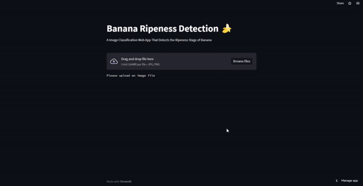
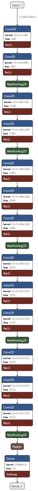

# Banana Ripeness Detection 🍌

### Features
- Predict the ripeness stage of banana.
- Classify banana into three different categories.
- Model can be used to predict other fruits as well.
- Simple and easy to understand architecture.
- Web app for testing images in realtime.

[Try it Now](https://share.streamlit.io/abhayparashar31/brd/main/app.py)

### Model Architecture

## Contributing

Contributions are always welcome!!!!

**Developed By** [@abhayparashar31](https://github.com/Abhayparashar31)
